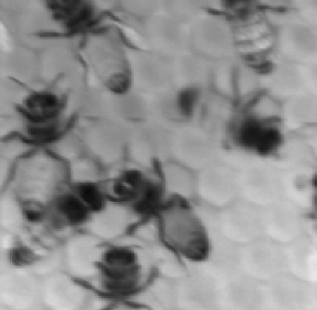
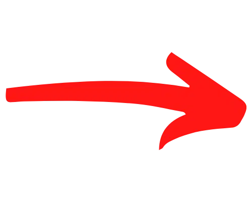
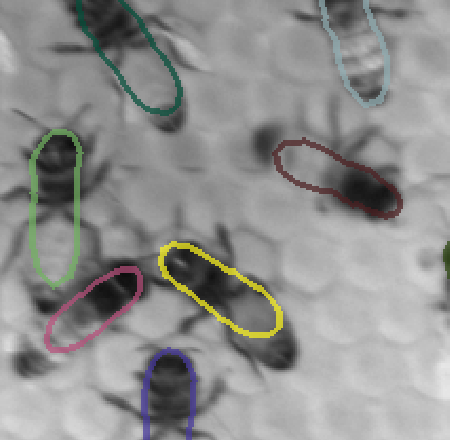
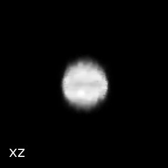

# SciPy 2024 Tutorial Submissions: GPU image analysis and Deep Learning using the Image.sc ecosystem. 

  

  

A short course exploring GPU image analysis and deep learning using tools, techniques and inspiration from Image.sc.  Image.sc is a discussion forum for scientific imaging with over 60 scientific partners, including CLIJ, Napari and Stardist.  In this tutorial we will use those toolkits, in addition to Cupy and Pytorch to tackle difficult image segmentation and restoration problems.  The course is a condensed and modified version of a 2.5 day [GPU image-analysis course](https://github.com/BiAPoL/PoL-BioImage-Analysis-TS-GPU-Accelerated-Image-Analysis/tree/main?tab=readme-ov-file) held at TU Dresden - Physics of Life in August 2023, and also uses material from the [Napari Halfway to I2K Tutorial](https://github.com/kephale/napari-workshop-halfway-to-i2k).   This course consists of 4 main sections.

1.  Classical image processing on the GPU using Clij, CLesperanto and Cupy
2.  Convolution and Deconvolution on the GPU.
3.  Pixel Classification using Machine Learning 
4.  Deep Learning using Stardist and PyTorch.

Throughout the course we will use the Napari Viewer to explore, compare and annotate images.  We plan to use the same image set throughout each section and demonstrate, with real examples how analysis results evolve as we move from classical image processing, to pixel classification to deep learning.

## Long description

This tutorial is designed for intermediate Python programmers and image analysts who want to speed up their classical image processing workflows by using GPUs.  It also covers how to run high-computation advanced workflows, such as deconvolution and deep learning, which would otherwise be very time-consuming without GPU acceleration.  Throughout the tutorial we will be using the Napari viewer as a means to visualize image processing workflows and as a tool to create labels for machine learning.

Some of the material is presented at a relatively high level and makes use of helper functions and templates.  For example Napari Plugin development and PyTorch are subjects that would take a multi-day course to cover in depth, but in this tutorial we present shorter, practical examples of these technologies using pre-cooked recipes.  

The tutorial is inspired by real questions on the Image.sc forum.  The first section of the tutorial will give an overview of classical image processing on the GPU using Clesperanto and Cupy, and show examples of images that are well suited to classical image processing (such as high SNR Nuclei), and some that aren't because of noise, blur and/or complex shapes and textures (such as tightly clustered bees).  The second section of the tutorial will discuss convolution and deconvolution and show GPU Deconvolution as a means to remove noise and blur from some types of image.   The third section will show interactive Machine Learning Pixel classification using the Napari Viewer.  The fourth section will show deep learning as an approach that can be used when the other techniques fail.  We will show both semantic segmentation using PyTorch and instance segmentation using Stardist. 

Required Hardware:  Problems will be designed by default to run on newer Intel/AMD laptops with a 4G+ Nvidia/AMD Graphics card and newer (M1 and above) ARM Macs.  Though the problem size will be configurable and could be made smaller for older laptops or larger for students with access to remote processing power.  A test script will be available a month before the tutorial so students can verify the exercises will run on their hardware. 

Setup Instructions:  Setup instructions and test scripts to verify installation will be available a month before the tutorial.  Pre-tutorial setup support will be available on Image.sc. 

A draft outline of the tutorial (subject to change)

* Introduction and quick review of setup instructions and dependencies (10 minutes). 
* Clesperanto and Cupy (40 minutes)
    * Selecting devices
    * gpu image arrays and gpu memory management
    * Clesperanto segmentation example using nuclei, bee, and root images
    * CLesperanto measurement and quantification
    * Cupy basics
    * Cupy drop-in replacement
    * Benchmarking
* Convolution and Deconvolution (40 minutes)
    * Introduction to deconvolution and convolution
    * Convolution with Cupy and/or Numpy
    * Deconvolution and Segmentation of 3D Nuclei
    * Testing 3D deconvolution with a simulated image
* Interactive Machine Learning Pixel Classification with Napari (40 minutes)
    * Intro to machine learning pixel classification
    * Brief review of Napari Plugin GUI Development
    * Build a interactive Napari ML pixel classification plugin
    * Exercise:  Optimize ML pixel classificaton for the nuclei, bees and plant roots images, compare to results from section 1. 
* Deep Learning with PyTorch, Stardist and Napari (90 minutes)
    * Intro to Deep Learning and Convolutional Neural Networks
    * PyTorch, Tensorflow and Stardist setup
    * Semantic segmentation vs Instance Segmentation
    * Labelling Data with Napari
    * Receptive field and object extent
    * CNN design trade-offs with respect to GPU memory 
    * Augmentation and Normalization
    * Semantic Segmentation of Plant Roots with PyTorch
    * Instance Segmentation of tightly clustered bees with stardist
    * Excercise: Compare results of DL plant root and bee segmentation to results obtained in section 1 and 3.  